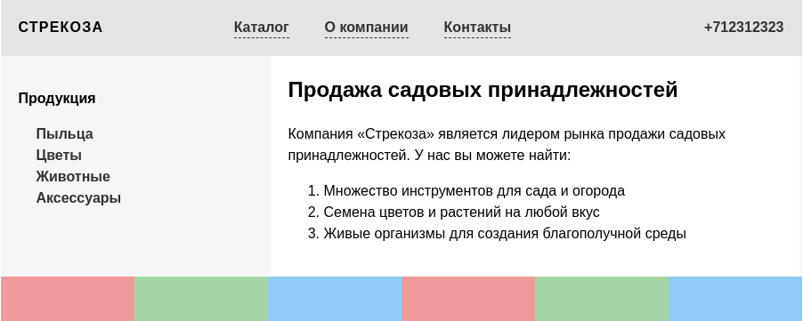

## Первая сетка

В этом задании вам предстоит создать три различные сетки. Создайте следующий макет:

Стили и классы для всех элементов уже готовы. Ваша задача — используя изученные свойства Grid, воссоздать сетку каждого контейнера. Таких контейнера три:

- Контейнер `.grid-header`. Внутри него находятся три колонки:
    - Первая колонка занимает пространство, равное максимальной ширине контента внутри колонки.
    - Третья колонка занимает 200 пикселей по ширине.
    - Вторая колонка занимает всё остальное пространство.

- Контейнер `.grid-main`. Внутри него находятся две колонки:
    - Первая колонка занимает 300 пикселей.
    - Вторая колонка занимает всё остальное пространство.

- Контейнер `.grid-footer`. Его задача — размещать колонки по 150 пикселей. Таких колонок может быть сколько угодно.