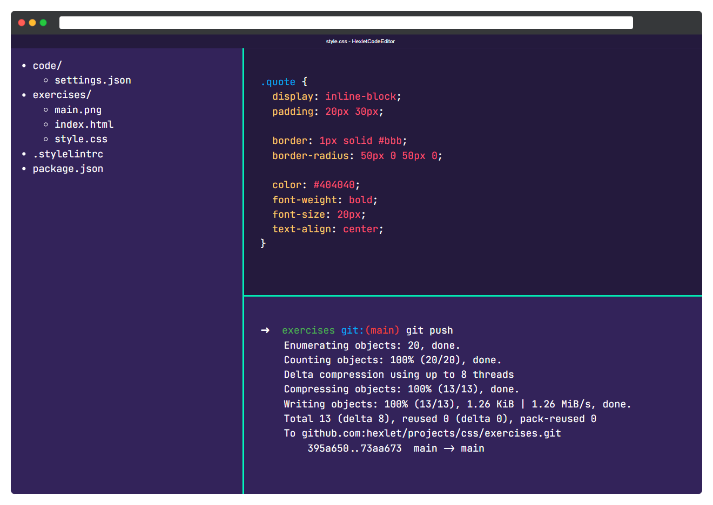
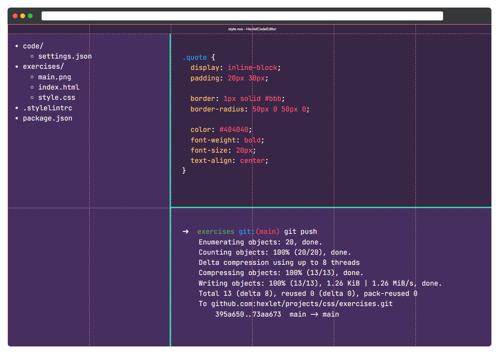

# Расположение элементов в сетке

Реализуйте сетку редактора *CodeEditor*. Основная вёрстка внутренних компонентов уже готова. Ваша задача — реализация сетки. Используйте тот способ, который кажется вам удобным. Сетка состоит из 6 колонок

## Финальная вёрстка

## Сетка шаблона

## Подсказки

- Для автоматической высоты колонок используйте значение `max-content` свойства `grid-template-rows`
- Вы можете использовать свойства `grid-template-areas` и `grid-template-columns` одновременно друг с другом. Это поможет лучше контролировать сетку и размеры ячеек.