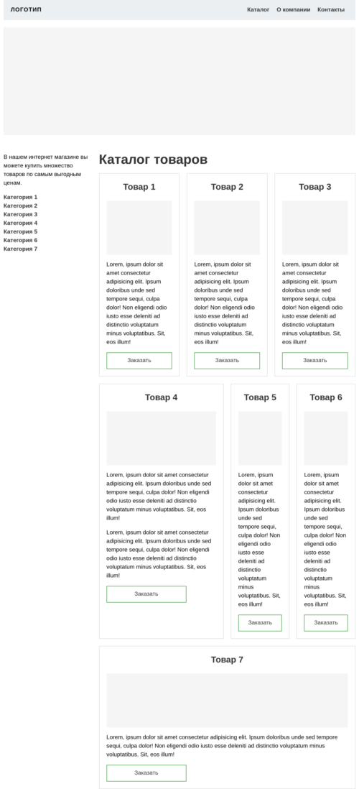

#  Работа с сеткой

Релизуйте шаблон двухколоночного сайта, используя сетки. В данном проекте сетки будет две:

- Общая сетка для всего шаблона. Сетка состоит из 8 колонок. С её помощью выстраиваются основные блоки макета:
    - Шапка сайта
    - Карусель
    - Левый сайдбар
    - Основной контент
- Сетка для карточек товара. Сетка состоит из 12 равных колонок. Главной её особенностью является гибкость. Все карточки получают пространство в зависимости от указаного класса. Например, класс `.col-4` предоставляет элементу 4 колонки внутри сетки.

Все классы и разметка уже готова, и они находятся в файле *index.html*.

Внутри основной сетки действуют следующие правила:

- Отступы между колонками по горизонтали и вертикали: 20 пикселей.
- Элементы внутри сетки имеют следующие размеры:
    - Шапка сайта: 8 колонок.
    - Карусель: 8 колонок.
    - Сайдбар: 2 колонки.
    - Контентная часть: 6 колонок.

Внутри сетки каталога действуют следующие правила:

- Отступы между колонками по горизонтали и вертикали: 20 пикселей.
- Товары имеют следующую ширину:
    - Товары 1, 2, 3: по 4 колонки.
    - Товар 4: 6 колонок.
    - Товары 5 и 6: по 3 колонки.
    - Товары 7: 12 колонок.

## Финальный вид задания

